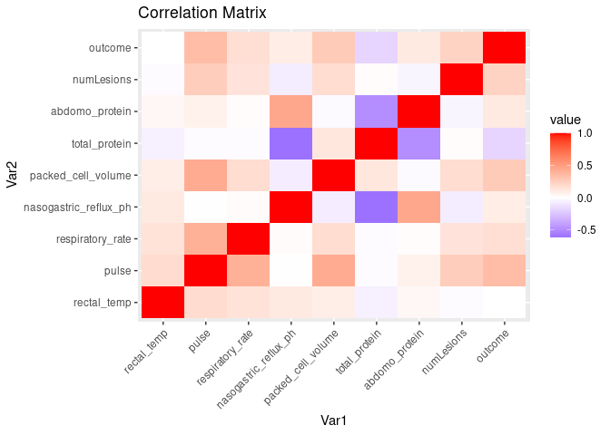

Data Preparation Script
================
JGSOLAR
2023-10-30

## Load libraries and functions

``` r
library(tidyverse)
library(dplyr)
library(gridExtra)
library(reshape2)
library(ggplot2)
library(plotly)
library(impute)
```

## Collect data

``` r
data <- read_csv("../../01.data/original/train.csv")
data_orig <- read_csv("../../01.data/original/horse.csv")
data <- data %>% select(-c("id"))
data <- data %>% rbind(data_orig)
data <- data %>% drop_na('outcome')

data$hospital_number <- as.character(data$hospital_number)
ohe_cols <- c("hospital_number", "mucous_membrane", "pain", "abdomen", 
              "abdomo_appearance", "lesionSite", "lesionType", "lesionSubType",
              "lesionCode", "surgery", "surgical_lesion", "age", "peristalsis", 
              "abdominal_distention", "nasogastric_tube", "rectal_exam_feces",
              "nasogastric_reflux", "capillary_refill_time", "peripheral_pulse",
              "temp_of_extremities")
non_ohe_cols <- setdiff(names(data), ohe_cols)
non_ohe_cols <- non_ohe_cols[non_ohe_cols != 'outcome']
```

## Analyse attributes

``` r
data <- data %>%
  mutate_if(is.character, as.factor)

summary(data)
```

    ##  surgery       age       hospital_number  rectal_temp       pulse       
    ##  no : 467   adult:1435   529461 :  48    Min.   :35.4   Min.   : 30.00  
    ##  yes:1067   young:  99   528548 :  33    1st Qu.:37.8   1st Qu.: 52.00  
    ##                          528996 :  23    Median :38.2   Median : 72.00  
    ##                          528469 :  21    Mean   :38.2   Mean   : 78.19  
    ##                          5290409:  21    3rd Qu.:38.6   3rd Qu.: 96.00  
    ##                          529667 :  21    Max.   :40.8   Max.   :184.00  
    ##                          (Other):1367    NA's   :60     NA's   :24      
    ##  respiratory_rate temp_of_extremities  peripheral_pulse      mucous_membrane
    ##  Min.   : 8.00    cold  :148          absent   : 26     pale_pink    :341   
    ##  1st Qu.:18.00    cool  :808          increased:  9     normal_pink  :339   
    ##  Median :28.00    None  : 39          None     : 60     pale_cyanotic:291   
    ##  Mean   :30.12    normal:402          normal   :543     bright_red   :236   
    ##  3rd Qu.:36.00    warm  : 81          reduced  :827     dark_cyanotic:141   
    ##  Max.   :96.00    NA's  : 56          NA's     : 69     (Other)      :139   
    ##  NA's   :58                                             NA's         : 47   
    ##  capillary_refill_time           pain            peristalsis 
    ##  3         :   4       depressed   :488   absent       :517  
    ##  less_3_sec:1021       mild_pain   :475   distend_small:  1  
    ##  more_3_sec: 471       severe_pain :184   hypermotile  : 92  
    ##  None      :   6       extreme_pain:162   hypomotile   :791  
    ##  NA's      :  32       alert       :125   None         : 20  
    ##                        (Other)     : 45   normal       : 69  
    ##                        NA's        : 55   NA's         : 44  
    ##  abdominal_distention    nasogastric_tube    nasogastric_reflux
    ##  moderate:608         none       :346     less_1_liter:313     
    ##  none    :287         None       : 80     more_1_liter:643     
    ##  None    : 23         significant:145     none        :450     
    ##  severe  :149         slight     :859     None        : 21     
    ##  slight  :411         NA's       :104     slight      :  1     
    ##  NA's    : 56                             NA's        :106     
    ##                                                                
    ##  nasogastric_reflux_ph     rectal_exam_feces          abdomen   
    ##  Min.   :1.000         absent       :572     distend_large:437  
    ##  1st Qu.:2.000         decreased    :317     distend_small:525  
    ##  Median :4.500         increased    : 62     firm         : 85  
    ##  Mean   :4.396         None         :190     None         :213  
    ##  3rd Qu.:6.200         normal       :290     normal       :104  
    ##  Max.   :7.500         serosanguious:  1     other        : 52  
    ##  NA's   :246           NA's         :102     NA's         :118  
    ##  packed_cell_volume total_protein      abdomo_appearance abdomo_protein  
    ##  Min.   :23.00      Min.   : 3.3   clear        :299     Min.   : 0.100  
    ##  1st Qu.:42.00      1st Qu.: 6.6   cloudy       :406     1st Qu.: 2.000  
    ##  Median :48.00      Median : 7.5   None         : 48     Median : 3.000  
    ##  Mean   :49.01      Mean   :21.9   serosanguious:616     Mean   : 3.272  
    ##  3rd Qu.:55.00      3rd Qu.:13.0   NA's         :165     3rd Qu.: 4.300  
    ##  Max.   :75.00      Max.   :89.0                         Max.   :10.100  
    ##  NA's   :29         NA's   :33                           NA's   :198     
    ##  surgical_lesion    lesion_1        lesion_2          lesion_3       cp_data  
    ##  no : 415        Min.   :    0   Min.   :   0.00   Min.   :   0.00   no :767  
    ##  yes:1119        1st Qu.: 2124   1st Qu.:   0.00   1st Qu.:   0.00   yes:767  
    ##                  Median : 2209   Median :   0.00   Median :   0.00            
    ##                  Mean   : 3799   Mean   :  29.41   Mean   :   4.32            
    ##                  3rd Qu.: 3205   3rd Qu.:   0.00   3rd Qu.:   0.00            
    ##                  Max.   :41110   Max.   :7111.00   Max.   :2209.00            
    ##                                                                               
    ##        outcome   
    ##  died      :487  
    ##  euthanized:295  
    ##  lived     :752  
    ##                  
    ##                  
    ##                  
    ## 

There are several attributes with unencoded data, particularly in the
categorical ones. Afterwards, we address these unexpected values.

I did not find any anomalies in the quantitative attributes.

## Clean data

``` r
data <- data %>%
  mutate_if(is.factor, as.character)

data <- data %>%
  mutate(abdominal_distention = gsub("None", "none", abdominal_distention),
         nasogastric_tube = gsub("None", "none", nasogastric_tube),
         nasogastric_reflux = gsub("None", "none", nasogastric_reflux),
         temp_of_extremities = gsub("None", "normal", temp_of_extremities),
         peripheral_pulse = gsub("None", "normal", peripheral_pulse),
         mucous_membrane = gsub("None", "normal_pink", mucous_membrane),
         capillary_refill_time = gsub("None", "less_3_sec", 
                                      capillary_refill_time),
         capillary_refill_time = str_replace(capillary_refill_time, "^3$", 
                                             "less_3_sec"),
         pain = gsub("None", "alert", pain),
         pain = gsub("moderate", "mild_pain", pain),
         pain = gsub("slight", "alert", pain),
         peristalsis = gsub("distend_small", "normal", peristalsis),
         peristalsis = gsub("None", "normal", peristalsis),
         nasogastric_reflux = gsub("slight", "none", nasogastric_reflux),
         rectal_exam_feces = gsub("None", "normal", rectal_exam_feces),
         rectal_exam_feces = gsub("serosanguious", "normal", rectal_exam_feces),
         abdomen = gsub("None", "normal", abdomen),
         abdomo_appearance = gsub("None", "clear", abdomo_appearance))

data <- data %>%
  mutate_if(is.character, as.factor)

summary(data)
```

    ##  surgery       age       hospital_number  rectal_temp       pulse       
    ##  no : 467   adult:1435   529461 :  48    Min.   :35.4   Min.   : 30.00  
    ##  yes:1067   young:  99   528548 :  33    1st Qu.:37.8   1st Qu.: 52.00  
    ##                          528996 :  23    Median :38.2   Median : 72.00  
    ##                          528469 :  21    Mean   :38.2   Mean   : 78.19  
    ##                          5290409:  21    3rd Qu.:38.6   3rd Qu.: 96.00  
    ##                          529667 :  21    Max.   :40.8   Max.   :184.00  
    ##                          (Other):1367    NA's   :60     NA's   :24      
    ##  respiratory_rate temp_of_extremities  peripheral_pulse      mucous_membrane
    ##  Min.   : 8.00    cold  :148          absent   : 26     bright_pink  :118   
    ##  1st Qu.:18.00    cool  :808          increased:  9     bright_red   :236   
    ##  Median :28.00    normal:441          normal   :603     dark_cyanotic:141   
    ##  Mean   :30.12    warm  : 81          reduced  :827     normal_pink  :360   
    ##  3rd Qu.:36.00    NA's  : 56          NA's     : 69     pale_cyanotic:291   
    ##  Max.   :96.00                                          pale_pink    :341   
    ##  NA's   :58                                             NA's         : 47   
    ##  capillary_refill_time           pain          peristalsis 
    ##  less_3_sec:1031       alert       :170   absent     :517  
    ##  more_3_sec: 471       depressed   :488   hypermotile: 92  
    ##  NA's      :  32       extreme_pain:162   hypomotile :791  
    ##                        mild_pain   :475   normal     : 90  
    ##                        severe_pain :184   NA's       : 44  
    ##                        NA's        : 55                    
    ##                                                            
    ##  abdominal_distention    nasogastric_tube    nasogastric_reflux
    ##  moderate:608         none       :426     less_1_liter:313     
    ##  none    :310         significant:145     more_1_liter:643     
    ##  severe  :149         slight     :859     none        :472     
    ##  slight  :411         NA's       :104     NA's        :106     
    ##  NA's    : 56                                                  
    ##                                                                
    ##                                                                
    ##  nasogastric_reflux_ph rectal_exam_feces          abdomen    packed_cell_volume
    ##  Min.   :1.000         absent   :572     distend_large:437   Min.   :23.00     
    ##  1st Qu.:2.000         decreased:317     distend_small:525   1st Qu.:42.00     
    ##  Median :4.500         increased: 62     firm         : 85   Median :48.00     
    ##  Mean   :4.396         normal   :481     normal       :317   Mean   :49.01     
    ##  3rd Qu.:6.200         NA's     :102     other        : 52   3rd Qu.:55.00     
    ##  Max.   :7.500                           NA's         :118   Max.   :75.00     
    ##  NA's   :246                                                 NA's   :29        
    ##  total_protein      abdomo_appearance abdomo_protein   surgical_lesion
    ##  Min.   : 3.3   clear        :347     Min.   : 0.100   no : 415       
    ##  1st Qu.: 6.6   cloudy       :406     1st Qu.: 2.000   yes:1119       
    ##  Median : 7.5   serosanguious:616     Median : 3.000                  
    ##  Mean   :21.9   NA's         :165     Mean   : 3.272                  
    ##  3rd Qu.:13.0                         3rd Qu.: 4.300                  
    ##  Max.   :89.0                         Max.   :10.100                  
    ##  NA's   :33                           NA's   :198                     
    ##     lesion_1        lesion_2          lesion_3       cp_data         outcome   
    ##  Min.   :    0   Min.   :   0.00   Min.   :   0.00   no :767   died      :487  
    ##  1st Qu.: 2124   1st Qu.:   0.00   1st Qu.:   0.00   yes:767   euthanized:295  
    ##  Median : 2209   Median :   0.00   Median :   0.00             lived     :752  
    ##  Mean   : 3799   Mean   :  29.41   Mean   :   4.32                             
    ##  3rd Qu.: 3205   3rd Qu.:   0.00   3rd Qu.:   0.00                             
    ##  Max.   :41110   Max.   :7111.00   Max.   :2209.00                             
    ## 

## Codify lesions

To address the codification of lesions, I implemented the following
strategy:  
1. Counting the number of lesions and recording it in a new feature
`numLesions`.  
2. During the process, I observed that a few horses had more than one
lesion. Specefically, eight horses had two, and only two had three
lesions. To simplify the analysis, I chose to consider only one lesion
per horse, selecting the lesion with the highest `lesionSite` code.  
3. This approach streamlined the data modeling process, especially
considering the limited data available for modeling multidimensional
lesion variables involving concomitant lesions.  
4. Finally, I decoded the lesions into five different variables:
`numLesions`, `lesionSite`, `lesionType`, `lesionSubType` and
`lesionCode`.

``` r
data[c("lesion_1", "lesion_2", "lesion_3")] <- 
  lapply(data[c("lesion_1", "lesion_2", "lesion_3")], as.character)

data$numLesions <- rowSums(data[c("lesion_1", "lesion_2", "lesion_3")] != "0")

data$lesionSite <-  -1
data$lesionType <- -1
data$lesionSubType <- -1
data$lesionCode <- -1

non_ohe_cols <-  c(non_ohe_cols, 'numLesions')

for (i in 1:nrow(data)){
  for (j in c("lesion_1", "lesion_2", "lesion_3")){
    lesion_val = data[i, j]
    if (!is.na(lesion_val) && !is.na(lesion_val) ){
      if (nchar(lesion_val) == 5) {
        if (substr(lesion_val, 1, 2) == "11"){
          data$lesionSite[i] <- 11
          data$lesionType[i] <- substr(lesion_val, 3, 3) %>% as.numeric()
          data$lesionSubType[i] <- substr(lesion_val, 4, 4) %>% as.numeric()
          data$lesionCode[i] <- substr(lesion_val, 5, 5) %>% as.numeric()
        }
        else {
          if (data$lesionSite[i] < substr(lesion_val, 1, 1) %>% as.numeric()){
            data$lesionSite[i] <- substr(lesion_val, 1, 1) %>% as.numeric()
            data$lesionType[i] <- substr(lesion_val, 2, 2) %>% as.numeric()
            data$lesionSubType[i] <- substr(lesion_val, 3, 3) %>% as.numeric()
            data$lesionCode[i] <- substr(lesion_val, 4, 5) %>% as.numeric()
          }
        }
      }
      else {
        if (data$lesionSite[i] < substr(lesion_val, 1, 1) %>% as.numeric()) {
          lesion_val <- str_pad(lesion_val, width = 4, side = "right", pad = "0")
          data$lesionSite[i] <- substr(lesion_val, 1, 1) %>% as.numeric()
          data$lesionType[i] <- substr(lesion_val, 2, 2) %>% as.numeric()
          data$lesionSubType[i] <- substr(lesion_val, 3, 3) %>% as.numeric()
          data$lesionCode[i] <- substr(lesion_val, 4, 4) %>% as.numeric()
        }
      }
    }
  }
}

data <- data %>% select(-c("lesion_1", "lesion_2", "lesion_3"))
non_ohe_cols <- non_ohe_cols[!non_ohe_cols %in% c("lesion_1", "lesion_2", "lesion_3")]


lesionSiteDict <- c("11" = "all intestinal sites",
                    "1" = "gastric",
                    "2" = "sm intestine",
                    "3" = "lg colon",
                    "4" = "lg colon and cecum",
                    "5" = "cecum",
                    "6" = "transverse colon",
                    "7" = "retum/descending colon",
                    "8" = "uterus",
                    "9" = "bladder",
                    "0" = "none",
                    "-1" = "none")

lesionTypeDict <- c("1" = "simple",
                    "2" = "strangulation",
                    "3" = "inflammation",
                    "4" = "other",
                    "5" = "other",
                    "6" = "other",
                    "7" = "other",
                    "8" = "other",
                    "9" = "other",
                    "0" = "other",
                    "-1" = "other") 

lesionSubTypeDict <- c("1" = "mechanical",
                       "2" = "paralytic",
                       "3" = "n/a",
                       "4" = "n/a",
                       "5" = "n/a",
                       "6" = "n/a",
                       "7" = "n/a",
                       "8" = "n/a",
                       "9" = "n/a",
                       "0" = "n/a",
                       "-1" = "n/a")   

lesionCodeDict <- c("10" = "displacement",
                    "1" = "obturation",
                    "2" = "intrinsic",
                    "3" = "extrinsic",
                    "4" = "adynamic",
                    "5" = "volvulus/torsion",
                    "6" = "intussuption",
                    "7" = "thromboembolic",
                    "8" = "hernia",
                    "9" = "lipoma/slenic incarceration",
                    "0" = "n/a",
                    "-1" = "n/a")

data <- data %>% mutate(lesionSite = 
                          str_replace_all(lesionSite, lesionSiteDict),
                        lesionType = 
                          str_replace_all(lesionType, lesionTypeDict),
                        lesionSubType = 
                          str_replace_all(lesionSubType, lesionSubTypeDict),
                        lesionCode = 
                          str_replace_all(lesionCode, lesionCodeDict))
```

## Codify attributes

``` r
ohe_cols <- c(ohe_cols, "lesionSite", "lesionType", "lesionSubType", 
              "lesionCode")
data <- data %>% select(-c("cp_data"))
non_ohe_cols <- non_ohe_cols[!non_ohe_cols %in% c("cp_data")]
data[non_ohe_cols] <- lapply(data[non_ohe_cols], function(x) as.numeric(x))
```

# Coding hospital_number

I will consider only the most relevant hospital. If the number of
occurrences in the train data drop by 50% of the most frequent, the
institution will be coded as other

``` r
hospital_number_codifier <- as.data.frame(table(data$hospital_number))
colnames(hospital_number_codifier) <- c("hospital_number", "freq")
hospital_number_codifier <- hospital_number_codifier %>% arrange(desc(freq))

data$hospital_number <- data$hospital_number %>% factor(., ordered = FALSE)
```

Impute absent values

``` r
# numeric imputation (KNN_imputer in the pipeline is too slow)
data_temp <- data[, non_ohe_cols, drop = FALSE]
data_temp <- as.matrix(data_temp)
data_temp <- impute.knn(data_temp, k=10, rng.seed = 400)$data # Tested 17 and 5, 10 bringing the best result
```

    ## Warning in knnimp(x, k, maxmiss = rowmax, maxp = maxp): 23 rows with more than 50 % entries missing;
    ##  mean imputation used for these rows

    ## Cluster size 1511 broken into 1153 358 
    ## Done cluster 1153 
    ## Done cluster 358

``` r
data_temp <- as.data.frame(data_temp)
data[non_ohe_cols] <- data_temp
rm(data_temp)

data <- data %>% distinct()

# Nominal atributes will be imputed in the pipeline
```

## Complete initial preparations

## Exploratory analysis

``` r
# Passing outcome to numeric

data <- data %>% mutate(outcome = 
                          gsub("died", "2", outcome))

data <- data %>% mutate(outcome = 
                          gsub("euthanized", "1", outcome))

data <- data %>% mutate(outcome = 
                          gsub("lived", "0", outcome))

data <- data %>% relocate(outcome, .after = last_col())

data$outcome <- data$outcome %>% as.numeric()

histograms <- lapply(names(data[c(non_ohe_cols, 'outcome')]), function(var_name) {
  p <- ggplot(data, aes(x = .data[[var_name]])) +
    geom_histogram() +
    labs(title = var_name)
  
  ggplotly(p)
})

for (hist in histograms) {
  print(hist)
}
```

By the distribution of histogram, the variables `abdomo_protein`,
`pulse`, `respiratory_rate`, `total_protein` are left skewed and
`peristalsis` are right skewed.They will be treated in the pipeline.

In the pipeline, all numeric variables will be treated by
step_orderNorm().

``` r
left_skewed = c('abdomo_protein', 'pulse', 'respiratory_rate',
               'total_protein')
```

``` r
data_num <- data[c(non_ohe_cols, 'outcome')]

# Correlation verification
matrix_cor <- cor(data_num[, 1:ncol(data_num)], use = "complete.obs")

# Check correlation through heatmap
matrix_cor_melt <- reshape2::melt(matrix_cor)
ggplot(matrix_cor_melt, aes(x = Var1, y = Var2, fill = value)) +
  geom_tile() +
  scale_fill_gradient2(low = "blue", mid = "white", high = "red", midpoint = 0) +
  theme(axis.text.x = element_text(angle = 45, hjust = 1)) +
  labs(title = "Correlation Matrix")
```

<!-- -->

``` r
# data type definition for modeling
data$outcome <- data$outcome %>% factor(., levels = c("2", "1", "0"))
```

Conclusion: Any variable was found with a great correlation with the
outcome. I decided not to remove any variables, even if they have a low
correlation with the outcome, because combined variables can be
significant, even if they aren’t individually significant. Variables
with high correlation with each other will be removed in the pipeline.

## Save data prepared for model tunning

``` r
metadata <- list(
  'ohe_cols' = ohe_cols,
  'non_ohe_cols' = non_ohe_cols,
  'left_skewed' = left_skewed
)

write_rds(metadata, "../../01.data/processed/01.R/metadata.rds")
write_rds(data, "../../01.data/processed/01.R/dataPrepared.rds")
write_rds(hospital_number_codifier, "../../02.resources/01.R/hospital_number_codifier_v0.1.rds")
```
