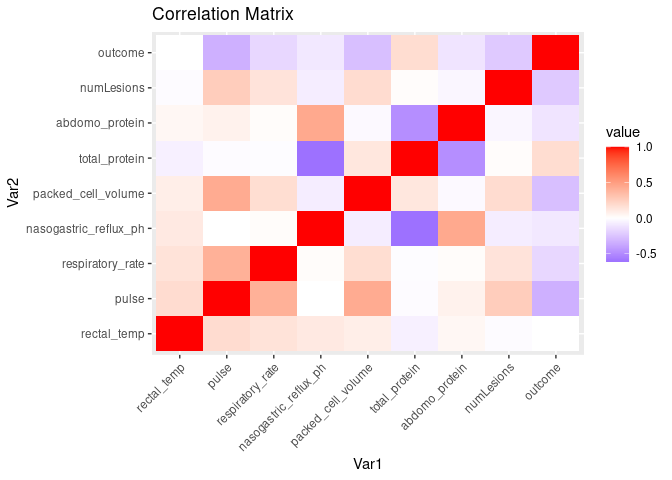

Exploratory analysis
================
João Gabriel Solar
2023-10-31

## Load libraries and functions

``` r
library(tidyverse)
library(gridExtra)
library(reshape2)
library(ggplot2)
library(plotly)
library(here)
source(here("03.scrub","01.R_tidy_verse_data_engineering.R"))
```

## Collect data

To increment available data, I’m including
[horse-survival-dataset](https://www.kaggle.com/datasets/yasserh/horse-survival-dataset)
in the training set.

``` r
data <- read_csv("../01.data/original/train.csv")
data_orig <- read_csv("../01.data/original/horse.csv")
data <- data %>% select(!c('id'))
data <- data %>% rbind(data_orig)
data <- data %>% drop_na('outcome')
rm(data_orig)
```

## Attributes analysis

To evaluate data tidiness, I’m using
[horse-survival-dataset](https://www.kaggle.com/datasets/yasserh/horse-survival-dataset)
features specifications.

``` r
data <- data %>%
  mutate_if(is.character, as.factor)

summary(data)
```

    ##  surgery       age       hospital_number    rectal_temp       pulse       
    ##  no : 467   adult:1435   Min.   : 518476   Min.   :35.4   Min.   : 30.00  
    ##  yes:1067   young:  99   1st Qu.: 528806   1st Qu.:37.8   1st Qu.: 52.00  
    ##                          Median : 529840   Median :38.2   Median : 72.00  
    ##                          Mean   : 980469   Mean   :38.2   Mean   : 78.19  
    ##                          3rd Qu.: 534259   3rd Qu.:38.6   3rd Qu.: 96.00  
    ##                          Max.   :5305629   Max.   :40.8   Max.   :184.00  
    ##                                            NA's   :60     NA's   :24      
    ##  respiratory_rate temp_of_extremities  peripheral_pulse      mucous_membrane
    ##  Min.   : 8.00    cold  :148          absent   : 26     pale_pink    :341   
    ##  1st Qu.:18.00    cool  :808          increased:  9     normal_pink  :339   
    ##  Median :28.00    None  : 39          None     : 60     pale_cyanotic:291   
    ##  Mean   :30.12    normal:402          normal   :543     bright_red   :236   
    ##  3rd Qu.:36.00    warm  : 81          reduced  :827     dark_cyanotic:141   
    ##  Max.   :96.00    NA's  : 56          NA's     : 69     (Other)      :139   
    ##  NA's   :58                                             NA's         : 47   
    ##  capillary_refill_time           pain            peristalsis 
    ##  3         :   4       depressed   :488   absent       :517  
    ##  less_3_sec:1021       mild_pain   :475   distend_small:  1  
    ##  more_3_sec: 471       severe_pain :184   hypermotile  : 92  
    ##  None      :   6       extreme_pain:162   hypomotile   :791  
    ##  NA's      :  32       alert       :125   None         : 20  
    ##                        (Other)     : 45   normal       : 69  
    ##                        NA's        : 55   NA's         : 44  
    ##  abdominal_distention    nasogastric_tube    nasogastric_reflux
    ##  moderate:608         none       :346     less_1_liter:313     
    ##  none    :287         None       : 80     more_1_liter:643     
    ##  None    : 23         significant:145     none        :450     
    ##  severe  :149         slight     :859     None        : 21     
    ##  slight  :411         NA's       :104     slight      :  1     
    ##  NA's    : 56                             NA's        :106     
    ##                                                                
    ##  nasogastric_reflux_ph     rectal_exam_feces          abdomen   
    ##  Min.   :1.000         absent       :572     distend_large:437  
    ##  1st Qu.:2.000         decreased    :317     distend_small:525  
    ##  Median :4.500         increased    : 62     firm         : 85  
    ##  Mean   :4.396         None         :190     None         :213  
    ##  3rd Qu.:6.200         normal       :290     normal       :104  
    ##  Max.   :7.500         serosanguious:  1     other        : 52  
    ##  NA's   :246           NA's         :102     NA's         :118  
    ##  packed_cell_volume total_protein      abdomo_appearance abdomo_protein  
    ##  Min.   :23.00      Min.   : 3.3   clear        :299     Min.   : 0.100  
    ##  1st Qu.:42.00      1st Qu.: 6.6   cloudy       :406     1st Qu.: 2.000  
    ##  Median :48.00      Median : 7.5   None         : 48     Median : 3.000  
    ##  Mean   :49.01      Mean   :21.9   serosanguious:616     Mean   : 3.272  
    ##  3rd Qu.:55.00      3rd Qu.:13.0   NA's         :165     3rd Qu.: 4.300  
    ##  Max.   :75.00      Max.   :89.0                         Max.   :10.100  
    ##  NA's   :29         NA's   :33                           NA's   :198     
    ##  surgical_lesion    lesion_1        lesion_2          lesion_3       cp_data  
    ##  no : 415        Min.   :    0   Min.   :   0.00   Min.   :   0.00   no :767  
    ##  yes:1119        1st Qu.: 2124   1st Qu.:   0.00   1st Qu.:   0.00   yes:767  
    ##                  Median : 2209   Median :   0.00   Median :   0.00            
    ##                  Mean   : 3799   Mean   :  29.41   Mean   :   4.32            
    ##                  3rd Qu.: 3205   3rd Qu.:   0.00   3rd Qu.:   0.00            
    ##                  Max.   :41110   Max.   :7111.00   Max.   :2209.00            
    ##                                                                               
    ##        outcome   
    ##  died      :487  
    ##  euthanized:295  
    ##  lived     :752  
    ##                  
    ##                  
    ##                  
    ## 

There are several categorical attributes with wrong coding. I did not
find any anomalies in the quantitative attributes. `cp_data` doesn’t
have any relevant information, according to reference
[horse-survival-dataset](https://www.kaggle.com/datasets/yasserh/horse-survival-dataset)
and will be removed.

## Lesions codification

The lesion code doesn’t respect normal form and must be separated. I’m
using the following criteria to address this separation: 1. Counting the
number of lesions and recording it in a new feature `numLesions`.  
2. During the process, I observed that a few horses had more than one
lesion. Specifically, eight horses had two, and only two had three
lesions. To simplify the analysis, I chose to consider only one lesion
per horse, selecting the lesion with the highest `lesionSite` code.
(This strategy couldn’t be applied in all platforms, given the
limitation and restrictions founded)  
3. This approach simplified feature engineering process, especially
considering the short data available.  
4. Finally, I decoded the lesions into five different variables:
`numLesions`, `lesionSite`, `lesionType`, `lesionSubType` and
`lesionCode`, each of them representing one dimension of lesion encoded.

## Data cleaning

For better comprehension of data characteristics, I’ll perform with data
cleaning before proceeding with exploratory analysis.

``` r
data <- data %>%
  mutate_if(is.factor, as.character)  # revertion of previous operation
results = scrub(data)
data <- results[[1]]
metadata <- results [[2]]
rm(results)
```

## Exploratory analysis

Attributes histogram analysis:

``` r
outcome = data['outcome']
outcome <- outcome %>% mutate(outcome =
                              gsub("2", "died", outcome))
outcome <- outcome %>% mutate(outcome =
                          gsub("1", "euthanized", outcome))
outcome <- outcome %>% mutate(outcome =
                          gsub("0", "lived", outcome))

cat_cols <- metadata$cat_cols
data_temp <- data[cat_cols]

data_temp['outcome'] <- outcome

# histograms <- lapply(names(data_temp), function(var_name) {
#   p <- ggplot(data_temp, aes(x = .data[[var_name]])) +
#     geom_bar() +
#     labs(title = var_name)
#   ggplotly(p)
# })
# 
# for (hist in histograms) {
#   print(hist)
# }

histograms <- lapply(names(data_temp), function(var_name) {
    p <- ggplot(data_temp, aes(x = .data[[var_name]])) +
        geom_bar() +
        labs(title = var_name)
    print(ggplotly(p))
    return(p)
})


rm(data_temp, outcome)
```

There are imbalanced data in categorical attributes, but I’ll keep them
as presented originally. The outcome variable, when possible, will pass
through a down sample process to balance it.

``` r
num_cols <- metadata$num_cols

histograms <- lapply(names(data[c(num_cols)]), function(var_name) {
  p <- ggplot(data, aes(x = .data[[var_name]])) +
    geom_histogram() +
    labs(title = var_name)
  ggplotly(p)
})
```

    ## `stat_bin()` using `bins = 30`. Pick better value with `binwidth`.
    ## `stat_bin()` using `bins = 30`. Pick better value with `binwidth`.
    ## `stat_bin()` using `bins = 30`. Pick better value with `binwidth`.
    ## `stat_bin()` using `bins = 30`. Pick better value with `binwidth`.
    ## `stat_bin()` using `bins = 30`. Pick better value with `binwidth`.
    ## `stat_bin()` using `bins = 30`. Pick better value with `binwidth`.
    ## `stat_bin()` using `bins = 30`. Pick better value with `binwidth`.
    ## `stat_bin()` using `bins = 30`. Pick better value with `binwidth`.

``` r
for (hist in histograms) {
  print(hist)
}
```

By the distribution of histogram, the variables `abdomo_protein`,
`pulse`, `respiratory_rate`, `total_protein` are left skewed. When
possible, they will be treated in the pipeline. In tidy models, as an
ORQ Normalization (step_orderNorm) is available, all numerical
attributes will pass through it.

``` r
left_skewed = c('abdomo_protein', 'pulse', 'respiratory_rate',
               'total_protein')
```

``` r
outcome <- data$outcome %>% as.numeric()
data_num <- cbind(data[c(num_cols)], outcome)

# Correlation verification
matrix_cor <- cor(data_num[, 1:ncol(data_num)], use = "complete.obs")

# Check correlation through heatmap
matrix_cor_melt <- reshape2::melt(matrix_cor)
ggplot(matrix_cor_melt, aes(x = Var1, y = Var2, fill = value)) +
  geom_tile() +
  scale_fill_gradient2(low = "blue", mid = "white", high = "red", midpoint = 0) +
  theme(axis.text.x = element_text(angle = 45, hjust = 1)) +
  labs(title = "Correlation Matrix")
```

<!-- -->

Any variable were found with great correlation with the outcome. I
decided not to remove any variables, even if they have a low correlation
with the outcome, because combined variables can be significant, even if
they aren’t individually significant. Variables with high correlation
with each other will be removed in the pipeline.
