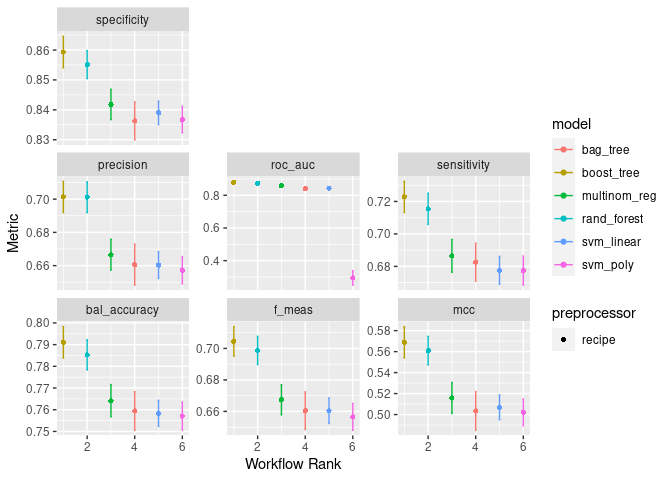
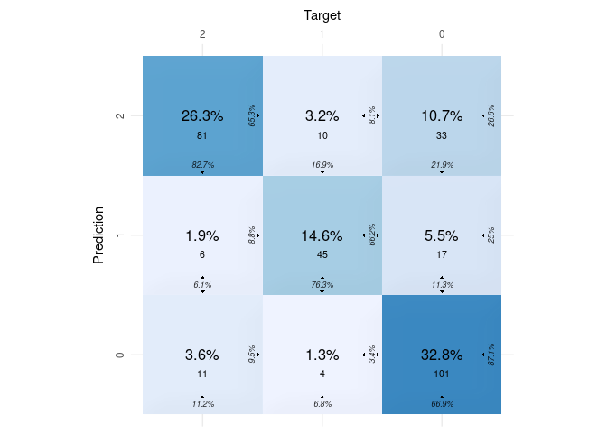
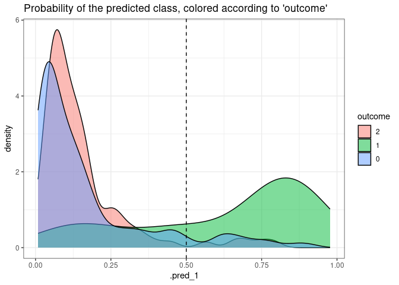

Modeling with R Tidy Models
================
João Gabriel Solar
2023-10-31

``` r
library(tidymodels)
library(dplyr)
library(bestNormalize)
library(workflowsets)
library(baguette) # bagTree
library(dbarts) #bart
library(xgboost) #xgboost
library(rules) #c5rules
library(naivebayes)
library(randomForest) #randomForest
library(kernlab) #svmPoly
library(earth) #mars/fda
library(mda) #fda
library(discrim) #naiveBayes/fda
library(sparsediscrim) #lda/qda
library(klaR) #rda
library(DALEXtra)
library(forcats) # Needed by DALEX - ggplot
library(glmnet)
library(ggimage) #Needed by cvms::plot_confusion_matrix
library(rsvg) #Needed by cvms::plot_confusion_matrix
library(parallel)
library(doParallel)
select <- dplyr::select  # select is masked by some libraries

library(here)
source(here("C_scrub","a_R_tidy_verse_data_engineering.R"))
```

# LOAD TRAINING DATA

``` r
data <- read_csv(here("A_data", "train.csv"))
```

    ## Rows: 1235 Columns: 29
    ## ── Column specification ────────────────────────────────────────────────────────
    ## Delimiter: ","
    ## chr (17): surgery, age, temp_of_extremities, peripheral_pulse, mucous_membra...
    ## dbl (12): id, hospital_number, rectal_temp, pulse, respiratory_rate, nasogas...
    ## 
    ## ℹ Use `spec()` to retrieve the full column specification for this data.
    ## ℹ Specify the column types or set `show_col_types = FALSE` to quiet this message.

``` r
data_orig <- read_csv(here("A_data", "horse.csv"))
```

    ## Rows: 299 Columns: 28
    ## ── Column specification ────────────────────────────────────────────────────────
    ## Delimiter: ","
    ## chr (17): surgery, age, temp_of_extremities, peripheral_pulse, mucous_membra...
    ## dbl (11): hospital_number, rectal_temp, pulse, respiratory_rate, nasogastric...
    ## 
    ## ℹ Use `spec()` to retrieve the full column specification for this data.
    ## ℹ Specify the column types or set `show_col_types = FALSE` to quiet this message.

``` r
data <- data %>% select(!c('id'))
data <- data %>% rbind(data_orig)
data <- data %>% drop_na('outcome')
rm(data_orig)
```

# SCRUB DATA

``` r
data = scrub(data, train=TRUE)[[1]]
```

    ## Warning in knnimp(x, k, maxmiss = rowmax, maxp = maxp): 23 rows with more than 50 % entries missing;
    ##  mean imputation used for these rows

    ## Cluster size 1511 broken into 694 817 
    ## Done cluster 694 
    ## Done cluster 817

# PARAMETERS DEFINITION

Preference to put customized options in the begining of the code, to
help tuning adjustments

``` r
random_seed = 9208
split_size = 0.8
folds_number = 4
high_correlation_threshold = 0.75
preferred_metric = "f_meas"

  # Options for preferred_metric:
  # sensitivity
  # specificity
  # precision
  # bal_accuracy
  # roc_auc
  # mcc
  # f_meas
```

Hyper parameter search grid size: Number of iterations based on the
number of hyper tuning parameters

``` r
lda_grid_size <- 1*20
qda_grid_size <- 1*20
rda_grid_size <- 2*20
fda_grid_size <- 3*20
tree_grid_size <- 3*20
# bagTree_grid_size <- 3^4  # Binary
bagTree_grid_size <- 3*20  # Multiclass
boostTree_grid_size <- 3*20
xgboost_grid_size <- 8*20
randForest_grid_size <- 3*20
mars_grid_size <- 3*20
bagMars_grid_size <- 3*20
naiveBayes_grid_size <- 2*20
bart_grid_size <- 4*20
c5rules_grid_size <- 2*20
logistReg_grid_size <- 2*20
svmLinear_grid_size <- 2*20
svmPoly_grid_size <- 4*20
svmRadial_grid_size <- 3*20
```

# SYSTEM SETTINGS

``` r
# Prepare for parallel processing
all_cores <- parallel::detectCores()
doParallel::registerDoParallel(cores = all_cores)
```

# SPLIT DATA

``` r
# create split
set.seed(random_seed)
data_split <- initial_split(data, prop = split_size, strata = outcome)

# Create the training data
train <- data_split %>%
  training()

test <- data_split %>%
  testing()

# Check class imbalance
train %>%
  group_by(outcome) %>%
  summarise(
    n = n(),
    perc = n/nrow(.)
  )
```

    ## # A tibble: 3 × 3
    ##   outcome     n  perc
    ##   <fct>   <int> <dbl>
    ## 1 2         388 0.317
    ## 2 1         236 0.193
    ## 3 0         600 0.490

``` r
test %>%
  group_by(outcome) %>%
  summarise(
    n = n(),
    perc = n/nrow(.)
  )
```

    ## # A tibble: 3 × 3
    ##   outcome     n  perc
    ##   <fct>   <int> <dbl>
    ## 1 2          98 0.318
    ## 2 1          59 0.192
    ## 3 0         151 0.490

``` r
# create data folds for cross validation
myFolds <- vfold_cv(train, repeats = folds_number,
                    strata = outcome)
```

# FEATURE ENGINEERING

``` r
data_recipe <- train %>%
  recipe(outcome ~ .) %>%
  step_impute_mode(all_nominal_predictors()) %>% 
  step_dummy(all_nominal_predictors()) %>% 
  step_zv(all_predictors()) %>%
  step_corr(all_numeric_predictors(), threshold = high_correlation_threshold) %>%
  step_orderNorm(all_numeric_predictors()) %>%
  step_normalize(all_numeric_predictors()) %>% 
  themis::step_nearmiss(outcome)
```

# MODEL FITTING

## create model-specific specs

``` r
lda_spec <- 
  parsnip::discrim_linear(regularization_method = tune()) %>% 
  set_engine("sparsediscrim") %>% 
  set_mode("classification")

qda_spec <- 
  parsnip::discrim_quad(regularization_method = tune()) %>% 
  set_engine("sparsediscrim") %>% 
  set_mode("classification")

rda_spec <- 
  parsnip::discrim_regularized(frac_common_cov = tune(),
                               frac_identity = tune()) %>%
  set_engine("klaR") %>% 
  set_mode("classification")


fda_spec <- 
  parsnip::discrim_flexible(num_terms = tune(),
                            prod_degree = tune(),
                            prune_method = tune()) %>%
  set_engine("earth") %>% 
  set_mode("classification")

tree_spec <- 
  parsnip::decision_tree(tree_depth = tune(),
                         min_n = tune(),
                         cost_complexity = tune()) %>%
  set_engine("rpart") %>% 
  set_mode("classification")

bagTree_spec <- 
  parsnip::bag_tree(
    #class_cost = tune(),   #Binários
    class_cost = NULL,     #Multiclasse 
    tree_depth = tune(),
    min_n = tune(),
    cost_complexity = tune()) %>% 
  set_engine("rpart") %>% 
  set_mode("classification")

boostTree_spec <- 
  parsnip::boost_tree(
    trees = tune(),
    min_n = tune(),
    sample_size = tune()) %>% 
  set_engine("C5.0") %>% 
  set_mode("classification")

xgboost_spec <- 
  parsnip::boost_tree(
    mtry = tune(), 
    trees = tune(), 
    min_n = tune(), 
    tree_depth = tune(),
    learn_rate = tune(), 
    loss_reduction = tune(), 
    sample_size = tune(),
    stop_iter = tune()) %>% 
  set_engine("xgboost") %>% 
  set_mode("classification")
  

randForest_spec <- 
  parsnip::rand_forest(
    mtry = tune(),
    trees = tune(),
    min_n = tune()
  ) %>% 
  set_engine("randomForest") %>% 
  set_mode("classification")

mars_spec <- 
  parsnip::mars(num_terms = tune(),
                prod_degree = tune(),
                prune_method = tune()) %>%
  set_engine("earth") %>% 
  set_mode("classification")

bagMars_spec <- 
  parsnip::bag_mars(num_terms = tune(),
                    prod_degree = tune(),
                    prune_method = tune()) %>%
  set_engine("earth") %>% 
  set_mode("classification")

naiveBayes_spec <- 
  parsnip::naive_Bayes(smoothness = tune(),
                       Laplace = tune()) %>% 
  set_engine("naivebayes") %>% 
  set_mode("classification")

bart_spec <- 
  parsnip::bart(
    trees = tune(),
    prior_terminal_node_coef = tune(),
    prior_terminal_node_expo = tune(),
    prior_outcome_range = tune()
  ) %>% 
  set_engine("dbarts") %>% 
  set_mode("classification")

c5rules_spec <- 
  parsnip::C5_rules(
    trees = tune(),
    min_n = tune()
  ) %>% 
  set_engine("C5.0") %>% 
  set_mode("classification")


# Binary - logistic_reg
# Multiclass - multinon_reg
logistReg_spec <- 
  # parsnip::logistic_reg(
  parsnip::multinom_reg(
    penalty = tune(),
    mixture = tune()
  ) %>% 
  set_engine("glmnet") %>% 
  set_mode("classification")


svmLinear_spec <- 
  parsnip::svm_linear(
    cost = tune(),
    margin = tune()
  ) %>% 
  set_engine("kernlab") %>% 
  set_mode("classification")

svmPoly_spec <- 
  parsnip::svm_poly(
    cost = tune(),
    degree = tune(),
    scale_factor = tune(),
    margin = tune()
  ) %>% 
  set_engine("kernlab") %>% 
  set_mode("classification")

svmRadial_spec <- 
  parsnip::svm_rbf(
    cost = tune(),
    rbf_sigma = tune(),
    margin = tune()
  ) %>% 
  set_engine("kernlab") %>% 
  set_mode("classification")
```

## create model-specific parameters

``` r
lda_params <- 
  dials::parameters(list(
    regularization_method()
  ))

qda_params <- 
  dials::parameters(list(
    regularization_method()
  ))

rda_params <- 
  dials::parameters(list(
    frac_common_cov(),
    frac_identity()
  ))

fda_params <- 
  dials::parameters(list(
    num_terms() %>% finalize(train), 
    prod_degree(),
    prune_method()
  ))

tree_params <- 
  dials::parameters(list(
    tree_depth(), 
    min_n(),
    cost_complexity()
  ))

bagTree_params <- 
  dials::parameters(list(
    #class_cost = dials::class_weights(),  # Binary
    #Multiclass, without tuning for class_cost
    dials::tree_depth(), 
    dials::min_n(),
    dials::cost_complexity()
  ))

boostTree_params <- 
  dials::parameters(list(
    dials::trees(),
    dials::min_n(),
    sample_size = dials::sample_prop()
  ))

xgboost_params <- 
  dials::parameters(list(
      dials::mtry() %>% finalize(train),
      dials::trees(),
      dials::min_n(),
      dials::tree_depth(),
      dials::learn_rate(),
      dials::loss_reduction(),
      sample_size = dials::sample_prop(),
      dials::stop_iter()
  ))

randForest_params <- 
  dials::parameters(list(
    dials::mtry() %>% finalize(train),  
    dials::trees(),
    dials::min_n()
  ))

mars_params <- 
  dials::parameters(list(
    dials::num_terms() %>% finalize(train), 
    dials::prod_degree(),
    dials::prune_method()
  ))

bagMars_params <- 
  dials::parameters(list(
    dials::num_terms() %>% finalize(train), 
    dials::prod_degree(),
    dials::prune_method()
  ))

naiveBayes_params <- 
  dials::parameters(list(
    dials::smoothness(),  
    dials::Laplace()
  ))

bart_params <- 
  dials::parameters(list(
    dials::trees(),  
    dials::prior_terminal_node_coef(),
    dials::prior_terminal_node_expo(),
    dials::prior_outcome_range()
  ))

c5rules_params <- 
  dials::parameters(list(
    dials::trees(),  
    dials::min_n()
  ))

logistReg_params <- 
  dials::parameters(list(
    dials::penalty(),  
    dials::mixture()
  ))

svmLinear_params <- 
  dials::parameters(list(
    dials::cost(), 
    margin = dials::svm_margin()
  ))

svmPoly_params <- 
  dials::parameters(list(
    dials::cost(), 
    dials::degree(),
    dials::scale_factor(),
    margin = dials::svm_margin()
  ))

svmRadial_params <- 
  dials::parameters(list(
    dials::cost(), 
    dials::rbf_sigma(),
    margin = dials::svm_margin()
  ))
```

## Generate irregular grids

``` r
lda_grid <- grid_latin_hypercube(lda_params,
                                 size = lda_grid_size
)

qda_grid <- grid_latin_hypercube(qda_params,
                                 size = qda_grid_size
)

rda_grid <- grid_latin_hypercube(rda_params,
                                 size = rda_grid_size
)

fda_grid <- grid_latin_hypercube(fda_params, 
                                 size = fda_grid_size
)

tree_grid <- grid_latin_hypercube(tree_params,
                                  size = tree_grid_size
)

bagTree_grid <- grid_latin_hypercube(bagTree_params, 
                                     size = bagTree_grid_size
)

boostTree_grid <- grid_latin_hypercube(boostTree_params, 
                                       size = boostTree_grid_size
)

xgboost_grid <- grid_latin_hypercube(xgboost_params, 
                                       size = xgboost_grid_size
)

randForest_grid <- grid_latin_hypercube(randForest_params, 
                                        size = randForest_grid_size
)

mars_grid <- grid_latin_hypercube(mars_params,
                                  size = mars_grid_size
)

bagMars_grid <- grid_latin_hypercube(bagMars_params,
                                     size = bagMars_grid_size
)

naiveBayes_grid <- grid_latin_hypercube(naiveBayes_params, 
                                        size = naiveBayes_grid_size
)

bart_grid <- grid_latin_hypercube(bart_params, 
                                  size = bart_grid_size
)

c5rules_grid <- grid_latin_hypercube(c5rules_params, 
                                     size = c5rules_grid_size
)

logistReg_grid <- grid_latin_hypercube(logistReg_params, 
                                       size = logistReg_grid_size
)

svmLinear_grid <- grid_latin_hypercube(svmLinear_params, 
                                       size = svmLinear_grid_size
)

svmPoly_grid <- grid_latin_hypercube(svmPoly_params, 
                                     size = svmPoly_grid_size
)

svmRadial_grid <- grid_latin_hypercube(svmRadial_params, 
                                       size = svmRadial_grid_size
)
```

## create a workflow SET

``` r
#Define which models will be trained
training_models <- list(
  # lda = lda_spec,
  # qda = qda_spec,
  # rda = rda_spec,
  # fda = fda_spec,
  # tree = tree_spec,
  bagTree = bagTree_spec,
  # boostTree = boostTree_spec,
  xgboost = xgboost_spec,
  randForest = randForest_spec,
  # mars = mars_spec,
  # bagMars = bagMars_spec,
  # naiveBayes = naiveBayes_spec,
  # bart = bart_spec,
  # c5rules = c5rules_spec,
  logistReg = logistReg_spec,
  svmLinear = svmLinear_spec,
  svmPoly = svmPoly_spec
  # svmRadial = svmRadial_spec
)

my_models <- 
  workflow_set(
    preproc = list(data_recipe),
    models = training_models,
    cross = TRUE
  ) %>%
  option_add(grid = lda_grid, id = "recipe_lda") %>%
  option_add(grid = qda_grid, id = "recipe_qda") %>%
  option_add(grid = rda_grid, id = "recipe_rda") %>%
  option_add(grid = fda_grid, id = "recipe_fda") %>%
  option_add(grid = tree_grid, id = "recipe_tree") %>%
  option_add(grid = bagTree_grid, id = "recipe_bagTree") %>%
  option_add(grid = boostTree_grid, id = "recipe_boostTree") %>%
  option_add(grid = xgboost_grid, id = "recipe_xgboost") %>%
  option_add(grid = randForest_grid, id = "recipe_randForest") %>% 
  option_add(grid = mars_grid, id = "recipe_mars") %>%
  option_add(grid = bagMars_grid, id = "recipe_bagMars") %>%
  option_add(grid = naiveBayes_grid, id = "recipe_naiveBayes") %>%
  option_add(grid = bart_grid, id = "recipe_bart") %>%
  option_add(grid = c5rules_grid, id = "recipe_c5rules") %>%
  option_add(grid = logistReg_grid, id = "recipe_logistReg") %>%
  option_add(grid = svmLinear_grid, id = "recipe_svmLinear") %>%
  option_add(grid = svmPoly_grid, id = "recipe_svmPoly") %>% 
  option_add(grid = svmRadial_grid, id = "recipe_svmRadial")

my_models
```

    ## # A workflow set/tibble: 6 × 4
    ##   wflow_id          info             option    result    
    ##   <chr>             <list>           <list>    <list>    
    ## 1 recipe_bagTree    <tibble [1 × 4]> <opts[1]> <list [0]>
    ## 2 recipe_xgboost    <tibble [1 × 4]> <opts[1]> <list [0]>
    ## 3 recipe_randForest <tibble [1 × 4]> <opts[1]> <list [0]>
    ## 4 recipe_logistReg  <tibble [1 × 4]> <opts[1]> <list [0]>
    ## 5 recipe_svmLinear  <tibble [1 × 4]> <opts[1]> <list [0]>
    ## 6 recipe_svmPoly    <tibble [1 × 4]> <opts[1]> <list [0]>

## create custom metrics

``` r
data_metrics <- metric_set(yardstick::sensitivity,
                           yardstick::specificity,
                           yardstick::precision,
                           yardstick::bal_accuracy,
                           yardstick::roc_auc,
                           yardstick::mcc,
                           yardstick::f_meas)
```

## actual tuning

``` r
system.time ({
  model_race <- my_models %>% 
    workflow_map("tune_grid", resamples = myFolds, verbose = TRUE,
                 control = tune::control_grid(verbose = TRUE),
                 metrics = data_metrics)
})
```

    ## i 1 of 6 tuning:     recipe_bagTree

    ## ✔ 1 of 6 tuning:     recipe_bagTree (4m 21.9s)

    ## i 2 of 6 tuning:     recipe_xgboost

    ## ✔ 2 of 6 tuning:     recipe_xgboost (14m 52.7s)

    ## i 3 of 6 tuning:     recipe_randForest

    ## ✔ 3 of 6 tuning:     recipe_randForest (15m 11.8s)

    ## i 4 of 6 tuning:     recipe_logistReg

    ## ✔ 4 of 6 tuning:     recipe_logistReg (4m 17s)

    ## i 5 of 6 tuning:     recipe_svmLinear

    ## ✔ 5 of 6 tuning:     recipe_svmLinear (1m 21.6s)

    ## i 6 of 6 tuning:     recipe_svmPoly

    ## ✔ 6 of 6 tuning:     recipe_svmPoly (4m 0.8s)

    ##   usuário   sistema decorrido 
    ## 99313.057  1621.322  2650.029

# Performance evaluation and selection of the best model

## MODEL COMPARISON

``` r
# show metrics for the models
model_race %>% collect_metrics(metrics = data_metrics) %>%
  group_by(wflow_id)
```

    ## # A tibble: 3,045 × 9
    ## # Groups:   wflow_id [6]
    ##    wflow_id       .config   preproc model .metric .estimator  mean     n std_err
    ##    <chr>          <chr>     <chr>   <chr> <chr>   <chr>      <dbl> <int>   <dbl>
    ##  1 recipe_bagTree Preproce… recipe  bag_… bal_ac… macro      0.747    40 0.00485
    ##  2 recipe_bagTree Preproce… recipe  bag_… f_meas  macro      0.641    40 0.00679
    ##  3 recipe_bagTree Preproce… recipe  bag_… mcc     multiclass 0.477    40 0.0102 
    ##  4 recipe_bagTree Preproce… recipe  bag_… precis… macro      0.641    40 0.00675
    ##  5 recipe_bagTree Preproce… recipe  bag_… roc_auc hand_till  0.833    40 0.00443
    ##  6 recipe_bagTree Preproce… recipe  bag_… sensit… macro      0.667    40 0.00637
    ##  7 recipe_bagTree Preproce… recipe  bag_… specif… macro      0.827    40 0.00356
    ##  8 recipe_bagTree Preproce… recipe  bag_… bal_ac… macro      0.749    40 0.00415
    ##  9 recipe_bagTree Preproce… recipe  bag_… f_meas  macro      0.644    40 0.00550
    ## 10 recipe_bagTree Preproce… recipe  bag_… mcc     multiclass 0.481    40 0.00851
    ## # ℹ 3,035 more rows

``` r
# show performance of competing models
autoplot(model_race, select_best = TRUE, rank_metric = preferred_metric)
```

<!-- -->

Comparing metrics, xgboost is the best suitable technique.

Definition of selected technique:

``` r
selectedModel = "recipe_xgboost"
```

## MODEL FINALIZATION

``` r
# combine parameter combinations with metrics and predictions
results <- model_race %>% 
  extract_workflow_set_result(selectedModel)

# select best workflow
best_results <- results %>%
  select_best(metric = preferred_metric)

# finalize workflow
tree_wkfl <- model_race %>%
  extract_workflow(selectedModel) %>%
  finalize_workflow(best_results)

# assess model performance across different folds of train data
tree_res_results <- tree_wkfl %>%
  fit_resamples(resamples = myFolds,
                metrics = data_metrics,
                control = control_resamples(save_pred = TRUE))

# get metrics of training folds
collect_metrics(tree_res_results)
```

    ## # A tibble: 7 × 6
    ##   .metric      .estimator  mean     n std_err .config             
    ##   <chr>        <chr>      <dbl> <int>   <dbl> <chr>               
    ## 1 bal_accuracy macro      0.789    40 0.00462 Preprocessor1_Model1
    ## 2 f_meas       macro      0.701    40 0.00590 Preprocessor1_Model1
    ## 3 mcc          multiclass 0.564    40 0.00944 Preprocessor1_Model1
    ## 4 precision    macro      0.698    40 0.00582 Preprocessor1_Model1
    ## 5 roc_auc      hand_till  0.878    40 0.00386 Preprocessor1_Model1
    ## 6 sensitivity  macro      0.719    40 0.00611 Preprocessor1_Model1
    ## 7 specificity  macro      0.858    40 0.00333 Preprocessor1_Model1

``` r
# train on training data and test on test data
tree_final <- tree_wkfl %>%
  last_fit(split = data_split, 
           metrics = data_metrics,
           control = control_last_fit(allow_par = TRUE)) 
```

## PREDICTIONS & CONFUSION MATRIX

``` r
# get performance metrics on test data in last_fit object
tree_final$.metrics
```

    ## [[1]]
    ## # A tibble: 7 × 4
    ##   .metric      .estimator .estimate .config             
    ##   <chr>        <chr>          <dbl> <chr>               
    ## 1 sensitivity  macro          0.753 Preprocessor1_Model1
    ## 2 specificity  macro          0.869 Preprocessor1_Model1
    ## 3 precision    macro          0.729 Preprocessor1_Model1
    ## 4 bal_accuracy macro          0.811 Preprocessor1_Model1
    ## 5 mcc          multiclass     0.602 Preprocessor1_Model1
    ## 6 f_meas       macro          0.732 Preprocessor1_Model1
    ## 7 roc_auc      hand_till      0.885 Preprocessor1_Model1

``` r
# create fit object on training data
tree_fit <- fit(tree_wkfl, train)

# predict
tree_train_pred <- predict(tree_fit, train) %>%
  bind_cols(train["outcome"]) 

# create confusion matrix on train data
cm_train <- conf_mat(tree_train_pred, 
                     truth = outcome,
                     estimate = .pred_class)

cm_train <- as_tibble(cm_train$table)
colnames(cm_train)=c("Prediction", "Target", "N")
cvms::plot_confusion_matrix(cm_train)
```

<!-- -->

``` r
# create confusion matrix on test data
cm_test <- conf_mat(tree_final$.predictions[[1]], 
                    truth = outcome,
                    estimate = .pred_class)

cm_test <- as_tibble(cm_test$table)
colnames(cm_test)=c("Prediction", "Target", "N")
cvms::plot_confusion_matrix(cm_test)
```

<!-- -->

## PERFORMANCE VISUALIZATIONS

``` r
# plot predictions
data.frame(tree_final$.predictions) %>%
  ggplot() +
  geom_density(aes(x = .pred_1, fill = outcome),
               alpha = 0.5)+
  geom_vline(xintercept = 0.5,linetype = "dashed")+
  ggtitle("Probability of the predicted class, colored according to 'outcome'")+
  theme_bw()
```

<!-- -->

# Save selected model

``` r
saveRDS(tree_fit, here("B_resources", "a_R", "modelXGBoost.rds"))
```
