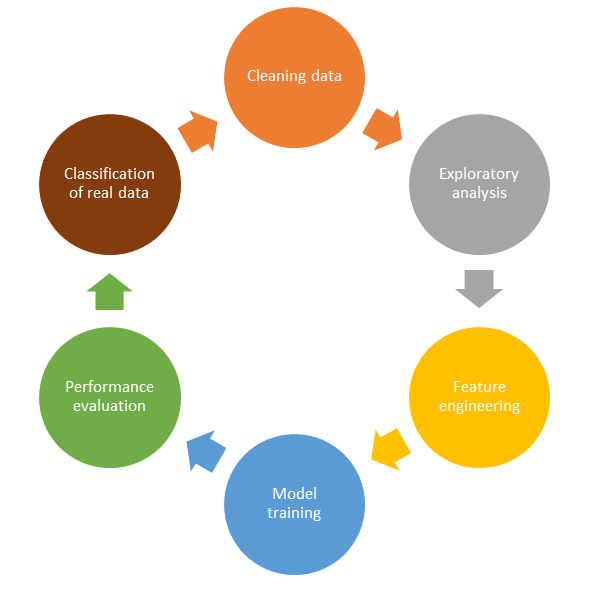

# Multiplatform classifier
November 1, 2023.

To evaluate the complexity of implementing a data science pipeline,
a classification project was implemented on four different platforms with 
specific tools:

A. R, using tidyverse and tidymodels;  
B. Python, using pandas and scikit-learn;  
C. CUDA RAPIDS, using cuDF and cuML for GPU processing;  
D. CUDA RAPIDS with DASK, which enables multi-node and multi-GPU processing.      

The project was developed encompassing all stages of a data science project,
which are presented in the diagram below:

All these stages were completely developed in each platform, except for the 
exploratory analysis, which highlights data characteristics and guided the 
developing process, that was performed in R, using tidyverse.

## Platforms insights

The development of this side by side pipeline, in each of the consolidated
technologies for data science, allowed a good evaluation of their differences,
regarding: coding complexities, available resources, efficiency of the debugging 
process, computing power delivered and restrictions in developer coding liberty.

After accomplishing this rewardful challenge, I share some of my achieved views:

1. R, powered by tidyverse and tidymodels, delivers a great and easy
framework for data science projects with easy to use tools, explained by
exceptional formal references and official websites. All the tools used inside this 
premium "swiss army knife" are well integrated and harmonized. The developer
has very few problems in the debugging process and has tons of tools to do almost
wherever he wants. Of course, there are always limitations. In R, the integration
with GPU and cluster computing is not native and needs a lot of work to
make than available, with experimental releases. If the scientist needs more 
computing power, integrating one or more GPUs or clustering computing in his
solution, I can't see yet in R the best option.  

2.  Python has a lot of powerful packages that can deliver almost any operation
desired by the programmer, but they are not made by the same group, and we don't
have compatibility guarantees between than. This is the great step made by Posit 
team with tidymodels, they engineered the ecosystem to work together. In Python,
the developer needs to enter in intricate error messages to make all the tools
he needs to interoperate. The good side is computing power. Python can deliver
good performance in its packages, delivering good parallel processing with
multiple CPU cores, almost transparent access to local GPU and complete integration
with CUDA environment through RAPIDS. If the scientist has a more complex problem
to solve that R, the premium "swiss army knife" cannot deliver the force needed,
Python will make this force available, with some effort for the developer.

3. CUDA RAPIDS enter a different complexity level. When operating in the GPU, the
CPU computing flexibility isn't available anymore. Parallel processing
brings a lot of restrictions on how to operate over data and make all data 
manipulation more complex. The number of packages and tools available is  
limited, what makes the scientist confined by the hardware characteristics and
the development degree of the official NVIDIA ecosystem. The GPU can offer great
computing power scalability, but this power cannot be delivered to every problem 
faced by the scientist. It's a powerful tool but not so versatile and flexible as
tidymodels and scikit-learn.

4. CUDA RAPIDS operating over DASK is the most challenger one. This platform isn't
designed to deliver a complete solution inside its ecosystem. It can offer 
exceptional tools for working on very huge amount of data, which cannot be allocated
in local memory and cannot be processed by local resources. But working on a 
parallel, lazied and partitioned ecosystem isn't an easy task. The strongest
recommendation is to work locally as soon as you can summarize your data to
fit it in your local resources.

